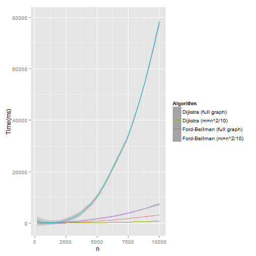

Поиск кратчайших путей в графе
========================================================

В данной работе рассмотрены следующие алгоритмы для поиска кратчайших путей в графе:
+ [Алгоритм Дейкстры][1]
+ [Алгоритм Беллмана-Форда][2]

В данной работе реализован алгоритм Дейкстры с использованием бинарной кучи, таким образом, его сложность составляет: O((E+V)*log(V)), 
где V - количество вершин в графе, E - количество ребер в графе. В свою очередь алгоритм Беллмана-Форда имеет сложность O(V*E).

Проведем несколько экспериментов для того, чтобы показать что реализация этих алгоритмов соотвествует заявленной теоретической оценке.


```r
library(ggplot2)

Dijkstra.exp1 = read.csv("data/1_Dejkstra_a.csv")
Dijkstra.exp2 = read.csv("data/1_Dejkstra_b.csv")
FordBellman.exp1 = read.csv("data/1_FordBellman_a.csv")
FordBellman.exp2 = read.csv("data/1_FordBellman_b.csv")
exp1 <- data.frame(Dijkstra.exp1$n, Dijkstra.exp1$time, Dijkstra.exp2$time, FordBellman.exp1$time, FordBellman.exp2$time)
colnames(exp1) <- c("n", "y1", "y2", "y3", "y4")
ggplot(exp1, aes(n, y = Time (ms), color = Algorithm)) + 
    geom_line(aes(y = y1, col="Dijkstra (m=n^2/10)")) + 
    geom_line(aes(y = y2, col="Dijkstra (full graph)")) +
    geom_line(aes(y = y3, col="Ford-Bellman (m=n^2/10)")) + 
    geom_line(aes(y = y4, col="Ford-Bellman (full graph)"))
```

 

Покажем, что сложность алгоритма действительно O((E+V)*log(V)). Разделим время на (n^2 + n)*log(n). И получим практически прямой график:


```r
Dijkstra.exp1$time = Dijkstra.exp1$time / ((Dijkstra.exp1$n * Dijkstra.exp1$n + Dijkstra.exp1$n) * log2(Dijkstra.exp1$n))
ggplot(Dijkstra.exp1, aes(n, y = ratio)) + geom_line(aes(y = time))
```

 

Построим аналогичный график для алгоритма Беллмана-Форда:


```r
FordBellman.exp1$time = 1000 * FordBellman.exp1$time / (FordBellman.exp1$n * FordBellman.exp1$n * FordBellman.exp1$n)
```

```
## Warning: целочисленное переполнение привело к созданию NA
```

```r
ggplot(FordBellman.exp1, aes(n, y = ratio)) + geom_line(aes(y = time))
```

```
## Warning: Removed 44 rows containing missing values (geom_path).
```

 

[1]: https://en.wikipedia.org/wiki/Dijkstra%27s_algorithm
[2]: https://en.wikipedia.org/wiki/Bellman%E2%80%93Ford_algorithm
