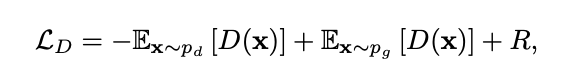

## Synthesizing Programs for Images using Reinforced Adversarial Learning
Authors: Yaroslav Ganin, Tejas Kulkarni, Igor Babuschkin, S. M. Ali Eslami, Oriol Vinyals

Paper: https://arxiv.org/pdf/1804.01118.pdf

Video: https://youtu.be/iSyvwAwa7vk

### Problem

- Deep generative networks works not so well on small datasets.
- Current methods that combine deep learning and renderers are limited by hand-crafted likelihood or distance functions, a need for large amounts of supervision, or difficulties in scaling their inference algorithms to richer datasets.

### Solution

This paper presents SPIRAL, an adversarially trained RL agent that generates a 
program which is executed by a graphics engine to interpret and sample images in 
order to mitigate the need for large amounts of supervision and difficulties in 
scaling inference algorithms to richer dataset.

__SPIRAL__

### Details

- The discriminator is trained using WGAN objective, where R is a regularization term softly constraining D to stay in the set of Lipschitz continuous functions (for some fixed Lipschitz constant).

- The generator is trained by A2C (Advantage Actor-Critic), a variant of the REINFORCE algorithm.

with following reward:

- Generator predicts a distribution over all possible commends.
- Utilized distributive learning
- They incorporate replay buffer technique to update model parameters and it works well in practice.

### Experiments

1. MNIST

    - Images rescaled to 64x64
    - 3 setup: generation, reconstruction, 'blind' reconstruction (do not feed intermediate canvas states as an input to the policy network)
    
    
    

2. OMNIGLOT

    - 1623 handwritten characters from 50 alphabets, only 20 data points for each symbol
    - Images rescaled to 64x64
    - 2 setup: generation, reconstruction 
    
    
      
    
3. CELEBA

    - 200,000 color headshots of celebrities with large variation in poses, backgrounds and lighting conditions.
    - Only reconstruction setup
    
4. MUJOCO

    - 3D scene contained up to 5 objects
    - Only reconstruction setup

    
    
    
### Environments

- MNIST, OMNIGLOT and CELEBA:
    - Framework: libmypaint.
    - State: Contents of the current canvas and the brush location.
    - Action: A tuple of 8 discrete decisions, control point, end point, pressure, brush size, color-R, color-G, color-B. (20 bins for each color component) and a binary decision that decides whether directly jump to the end point or produce a stroke.
    - Reward for unconditional generation: The discriminator score + small negative reward for starting each continuous sequence of strokes (encourage the agent to draw a digit in a single continuous motion of the brush) + negative reward for not producing any visible strokes at all.
    - Reward for conditional generation: Fixed L2 distance or the discriminator score.
- Environment of MUJOCO:
    - Framework: MuJoCo
    - Action: The object type (4 options), its location on a 16 × 16 grid, its size (3 options) and the color (3 color components with 4 bins each).
    - Reward for conditional generation: Same as the above setting.
    
### Results

- MNIST, OMNIGLOT

    
    
    - Utilizing a discriminator's output as the reward signal for RL is significantly better than directly optimizing the pixel error between rendered image and real image.
    - “Blind” does not reach the level of performance of the full model, it can still produce sensible reconstructions which suggests that their approach could be used in the more general setting of program synthesis, where access to intermediate states of the execution pipeline is not assumed.
    
- CELEBA, MUJOCO

    
    
    - Although blurry, the CELEBA's reconstruction closely matches the high-level structure of each image. For instance the background color, the position of the face and the color of
    the person’s hair. In some cases, shadows around eyes and
    the nose are visible.
    - Authors observed that model tends to generate strokes in the first half of the episode that
    are fully occluded by strokes in the second half.
    - In order to demonstrate the computational hardness of the task, we ran a general-purpose
    Metropolis-Hastings inference algorithm on a set of 100
    images. The algorithm samples an execution trace defining
    attributes for a maximum of 20 primitives. As shown in
    figure below, the MCMC search baseline was unable to solve
    the task even after a large number of evaluations.
    
    

### Contribution summary

- An adversarially trained reinforcement learning agent
that interprets and generates images in the space of
visual programs. Crucially, the architecture of our
agent is agnostic both to the semantics of the visual
program and to the domain.
- Scaling inverse graphics to real world and procedural
datasets without the need for labels. In particular, our
model discovers pen strokes that give rise to MNIST
and OMNIGLOT characters, brush strokes that give rise
to celebrity faces, and scene descriptions that, once rendered, reconstruct an image of a 3D scene (Figure 1).
- Evidence that utilizing a discriminator’s output as the
reward signal for reinforcement learning is significantly
better at optimizing the pixel error between renderings
and data, compared to directly optimizing pixel error.
- A showcase of state-of-the-art deep reinforcement
learning techniques, which can provide a scaling path
for inverse graphics, and could lead to broader implications for program synthesis in future work.

### Demonstration

